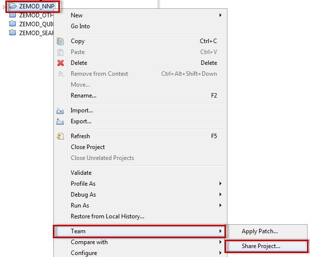
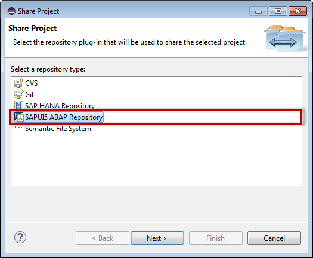
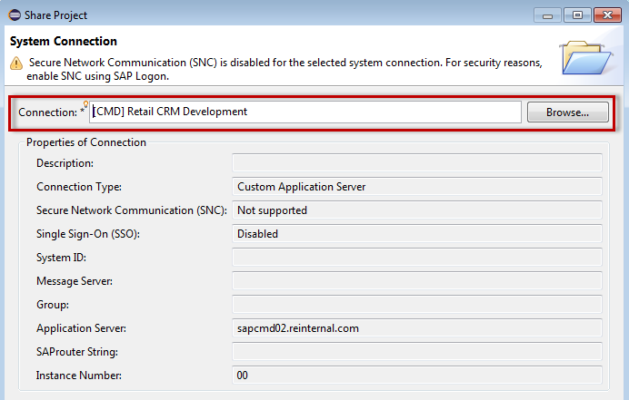
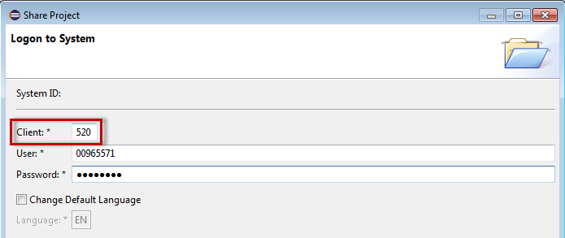
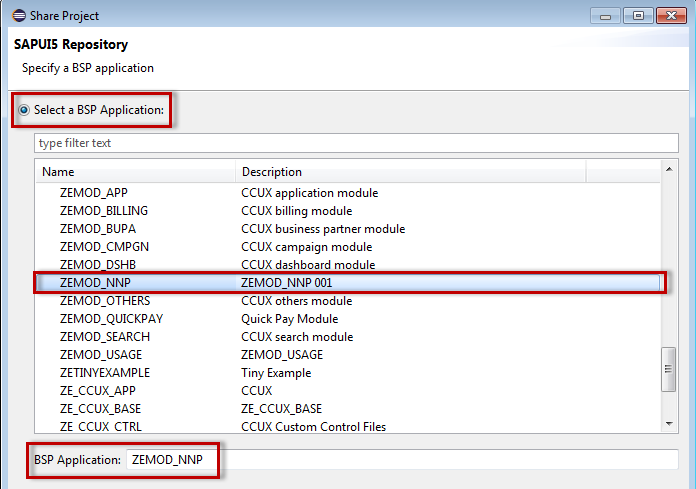
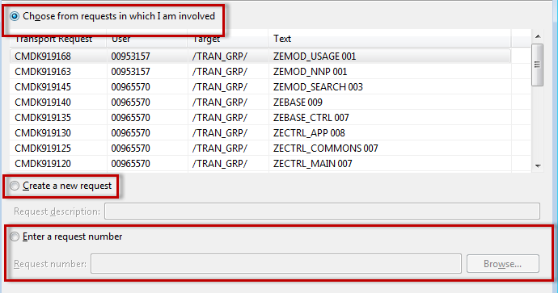
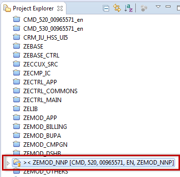
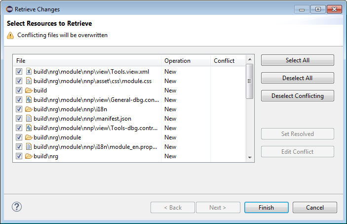
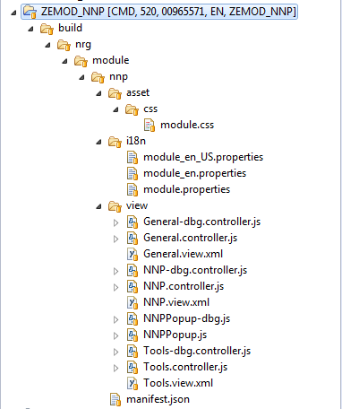
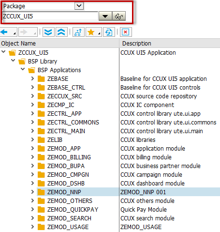

# Deploy #
Eclipse will be used to deploy the CCUX application to the SAPUI5 ABAP repository. Each eclipse project refers to a particular baseline, module, control or component.

Sections:

* [Setting up Eclipse](#markdown-header-setting-up-eclipse)
* [Grunt deploy tasks](#markdown-header-grunt-deploy-tasks)
* [Share CCUX application](#markdown-header-share-ccux-application)
* [Retrieve CCUX application](#markdown-header-retrieve-ccux-application)
* [Submit CCUX application](#markdown-header-submit-ccux-application)
* [Deploy ZELIB](#markdown-header-deploy-zelib)
* [SAPUI5 ABAP repository](#markdown-header-sapui5-abap-repository)

***
## Setting up Eclipse ##
Please make sure that you have [UI5 toolkit](prerequisites.md#markdown-header-sap-ui-development-toolkit-for-html5) installed in your Eclipse.

### File content ##
Setting relevant file content types to *Binary* prevents the [end of line marker](http://help.sap.com/saphelp_uiaddon10/helpdata/en/46/d0d54889be48d7abba0fa061c65835/content.htm) issue.

In your Eclipse, go to `Window > Preferences > Team > File Content`. The content type for the following extensions need to be set to *Binary*. If the entry is not in your Eclipse, please add it in by pressing `Add Extension...`.

Extension  | Extension | Extension | Extension | Extension | Extension | Extension     | Extension | Extension
---------- | --------- | --------- | --------- | --------- | --------- | ------------- | --------- | ---------
\*.bmp     | \*.class  |  \*.css   | \*.cur    | \*.dll    | \*.doc    | \*.eot        | \*.exe    | \*.gif
\*.htm     | \*.html   |  \*.ico   | \*.jar    | \*.jpeg   | \*.jpg    | \*.js         | \*.json   | \*.less
\*.library | \*.md     |  \*.off   | \*.pdf    | \*.png    | \*.ppt    | \*.properties | \*.so     | \*.theme
\*.tif     | \*.tiff   |  \*.ttf   | \*.txt    | \*.woff   | \*.xls    | \*.xml        | \*.zip    |

### SAP Logon ###
Eclipse reads SAP logon information from your **SAP GUI Local Configuration Files** only. If your SAP GUI is configured to read configuration files from the server only, please make a copy of the configuration files from the network and add them to your local machine as indicated below.


***
## Grunt deploy tasks ##
Grunt deploy tasks are being used to copy the generated build folders from CCUX to the corresponding Eclipse projects. The tasks are divided into four main scenarios and are maintained at:

Scenario  | Maintained at
--------- | ---------------------------
Module    | `grunt\deploy\module.js`
Control   | `grunt\deploy\control.js`
Baseline  | `grunt\deploy\base.js`
Component | `grunt\deploy\component.js`

##

In order to invoke Grunt to deploy a scenario, open your command prompt and navigate to your local CCUX repository root folder where the `Gruntfile.js` resides. Depending on your scenario, type one of the following commands:

**Module**
```
#!batch
grunt --deploy=module --moduleName=<module name> --moduleFolder=<module folder> --eclipseProjectPath=<eclipse project path>
```

> where
>
> <module folder> is the baseline folder name such as ZEMOD_APP
> <module name> is the baseline ui5 namespace such as nrg.module.app
> <eclipse project path> is the project path of the Eclipse project such as C:\Users\thew\workspace\eclipse\ZEMOD_APP

**Control**
```
#!batch
grunt --deploy=control --controlFolder=<control folder> --controlName=<control name> --eclipseProjectPath=<eclipse project path>
```

> where
>
> <control folder> is the baseline folder name such as ZECTRL_MAIN
> <control name> is the baseline ui5 namespace such as ute.ui.main
> <eclipse project path> is the project path of the Eclipse project such as C:\Users\thew\workspace\eclipse\ZECTRL_MAIN

**Baseline**
```
#!batch
grunt --deploy=base --baseFolder=<base folder> --baseName=<base name> --eclipseProjectPath=<eclipse project path>
```

> where
>
> <base folder> is the baseline folder name such as ZEBASE
> <base name> is the baseline ui5 namespace such as nrg.base
> <eclipse project path> is the project path of the Eclipse project such as C:\Users\thew\workspace\eclipse\ZEBASE

**Component**
```
#!batch
grunt --deploy=component --componentName=<component name> --componentFolder=<component folder> --eclipseProjectPath=<eclipse project path>
```

> where
>
> <component folder> is the baseline folder name such as ZECMP_IC
> <component name> is the baseline ui5 namespace such as nrg.component.ic
> <eclipse project path> is the project path of the Eclipse project such as C:\Users\thew\workspace\eclipse\ZECMP_IC

##

You can deploy the entire CCUX application to the corresponding Eclipse projects by running the following batch script:

```
#!batch
deploy ECLIPSE_WORKSPACE_PATH=<eclipse workspace path>
```

> where
>
> <eclipse workspace path> is the workspace path of the Eclipse project workspace such as C:\Users\thew\workspace\eclipse

***
## Share CCUX application ##
To share means to connect your local Eclipse project to a particular SAPUI5 ABAP repository BSP application. You will share an Eclipse project if you need to:

* _Upload a new_ module, control, baseline or component to SAPUI5 ABAP repository.
* _Download an existing_ module, control, baseline or component from SAPUI5 ABAP repository.

Go to `File > New > Project`.


Put your module, control, baseline or component folder name as project name. Press `Finish`.


Right-click the newly created project and choose `Team > Share Project...`.



Choose 'SAPUI5 ABAP Repository'. Press 'Next'.



Choose `SAP CMD`. Press `Next`. The SAP connection list is coming from your SAP GUI. If you are not seeing any entry, you might want to [read this up](#markdown-header-sap-logon).



Enter client `520` and your SAP logon credential to SAP CMD/520. 520 is CMD development client.



If you are uploading a new module, control, baseline or component to SAPUI5 ABAP repository, choose `Create a new BSP Application`. The name of the BSP application will be identical to the folder name of your module, control, baseline or component. Defaults the package to `ZCCUX_UI5`.


If you are downloading an existing module, control, baseline or component from SAPUI5 ABAP repository, choose `Select a BSP Application`. Select the BSP application that shares the same name as the folder name of your module, control, baseline or component.



Enter transport request information. Depending on your requirements, you are given the following options:



Once you have successfully shared a project, you will be able to see additional information beside the Eclipse project.



***
## Retrieve CCUX application ##
To retrieve means to copy the changes from SAPUI5 ABAP repository to your local Eclipse project. You will need to [share your Eclipse project](#markdown-header-share-ccux-application) before you can retrieve the changes.

Right-click your Eclipse project. Choose `Team > Retrieve`.


Pick all the resources that you would like to retrieve. Press `Finish`.



Once the retrieval is completed, you can see the changes in your Eclipse project.



***
## Submit CCUX application ##


***
## Deploy ZELIB ##


***
## SAPUI5 ABAP repository ##
The entire CCUX application is stored under package `ZCCUX_UI5`.


