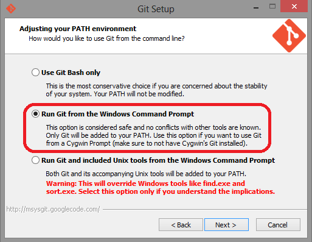

# Prerequisites
You need to make sure that you have the following applications installed and setup before you can begin your development.

***
## Git
You will need Git in order to interact with CCUX source code repository. You can get a copy of Git from the following link:

* [Git](https://git-scm.com/downloads)  

If you are installing Git in a Windows machine, please make sure that you are able to run Git from the command prompt. For example:

***
## Node.js
You will need to use Node.js to build your development. You can also use it as a web server to test your development locally. Please download a copy of Node.js from the following link:

* [Node.js](https://nodejs.org/download/)

***
## Editor
There is no restriction on the type of editor that you can use for your development but it would be wise to pick one that supports Javascript, CSS and XML. At the moment, we recommend the following editors due to their rich feature sets and popularities among web developers:

* [Atom](https://atom.io/)
* [Brackets](http://brackets.io/)
* [Sublime](http://www.sublimetext.com/)

***
## SAP UI Development Toolkit for HTML5
You will need to have this in place if you want to deploy your changes to the SAPUI5 ABAP Repository. You can follow the link below on how to install the toolkit:

[UI Development Toolkit for HTML5](https://tools.hana.ondemand.com/#sapui5)

In order to install the toolkit, you will need to have a compatible JRE and Eclipse IDE in your local machine.
